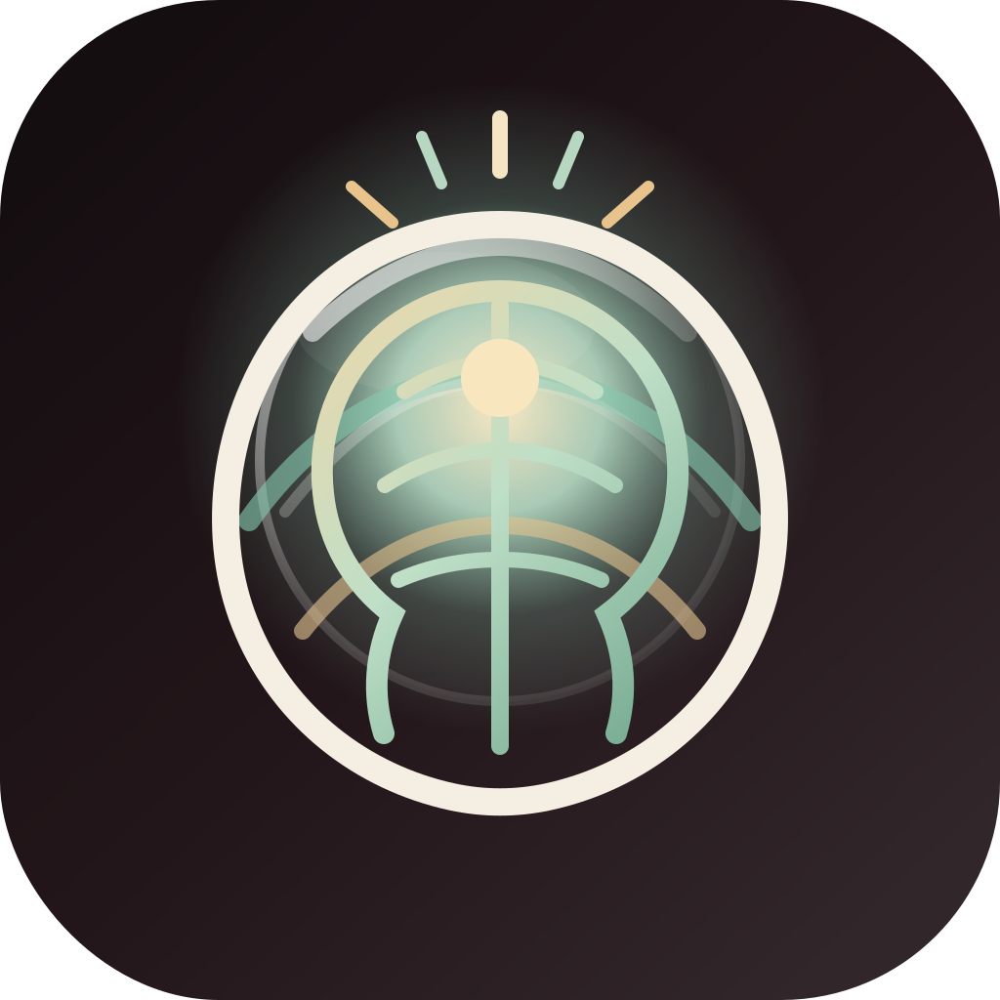
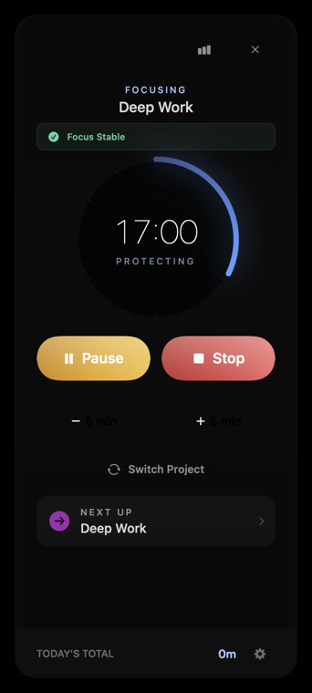
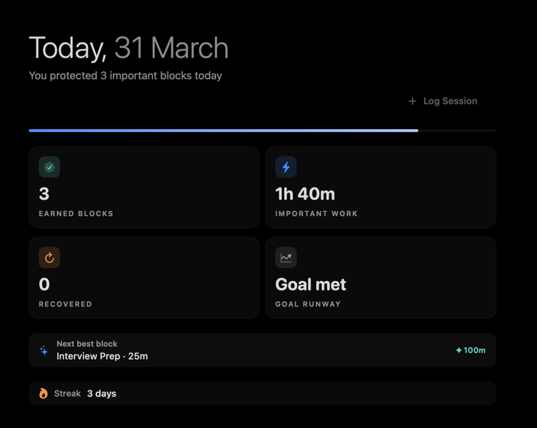
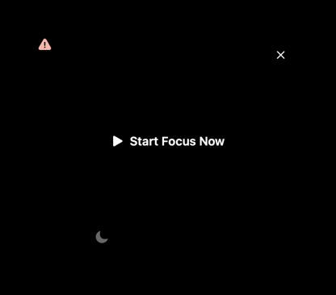
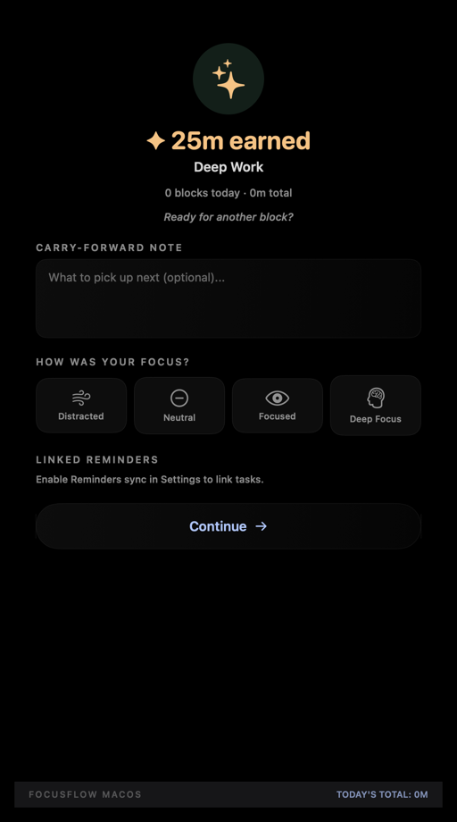

# FocusFlow

FocusFlow is a native macOS focus companion built for people who want more than a Pomodoro timer. It combines a fast menu bar workflow, a full companion window for planning and review, on-device coaching, and system-level distraction control in a product designed around Apple's Liquid Glass direction.




[](https://github.com/goyal-chintan/focus-flow/releases/latest)

## Screenshots

| Active focus session | Today dashboard |
|---|---|
|  |  |

| Strong coach intervention | Session completion |
|---|---|
|  |  |

## Product vision

FocusFlow is designed to reduce the gap between intention and action.

- **Calm, low-friction focus** in the menu bar for starting quickly and staying oriented.
- **Recovery-first coaching** that helps you get back on track without guilt-heavy nudges.
- **On-device intelligence** so behavior analysis, recommendations, and interventions stay private.
- **A premium native feel** built around an Obsidian Glass visual language, strong hierarchy, and restrained motion.

## What makes FocusFlow different

- **Two-surface workflow:** a lightweight menu bar timer plus a deeper companion window for planning, trends, projects, settings, and review.
- **Personal Focus Coach:** live drift detection, quick interventions, stronger re-engagement flows, and weekly insights.
- **Guardian intelligence:** app and website awareness, browser-domain tracking, and adaptive recommendations based on your real distraction patterns.
- **System-wide blocking:** optional website, app, and notification blocking tied to your focus sessions.
- **Apple integrations:** Calendar and Reminders support for planning, review, and session follow-through.
- **Privacy-first by default:** no cloud dependency, no account system, no remote inference.

## Features

### Menu bar timer

- Lives in the menu bar so the core workflow is always one click away.
- Preset focus durations plus custom minute entry.
- Minimum 5-minute session guard.
- Live timer ring with state-specific visual language for idle, focusing, paused, break, and overtime states.
- Pause, resume, stop, and abandon flows with explicit session-state handling.
- Session cycle tracking for short and long breaks.
- Blocking status surfaced directly in the popover when protections are active.

### Session completion and recovery

- Post-session reflection flow with mood, achievement notes, and time splitting across projects.
- Manual stop pathway with explicit save/discard behavior.
- Continue options after completion: take a break, keep focusing, or end the session.
- Adaptive **Suggested Earned Break** option that rewards longer or harder effort with a more appropriate recovery window.
- Break-overrun classification chips and recovery prompts to improve future recommendations.

### Companion window

The companion window is the app's deeper control room and includes:

- **Today** — daily totals, session timeline, project progress, reminders, and behavioral summaries.
- **Calendar** — session history and planning surfaces tied to Apple Calendar and Reminders.
- **Week** — trend views and longer-range progress summaries.
- **Insights** — productive-hour patterns, focus behavior analysis, and personalized coach guidance.
- **Projects** — project creation, editing, colors, icons, and archive management.
- **Settings** — timer preferences, integrations, launch behavior, blocking controls, and coach configuration.

### Smart project management

- Inline search-and-create project picker.
- Projects with custom colors and SF Symbol icons.
- Optional project-specific context such as linked blocking behavior.
- Archived projects remain preserved instead of being destructively deleted.

### Stats and analytics

- Daily focus totals, session counts, streaks, and per-project breakdowns.
- Session timeline with mood and achievement context.
- Weekly and longer-range trend views.
- Cross-midnight attribution so long sessions are split correctly across days.
- Editable historical sessions for fixing project, mood, or achievement details after the fact.
- Daily focus-goal tracking in analytics and settings.

### Personal Focus Coach

- Real-time drift/risk scoring during active sessions.
- Compact in-session interventions for quick recovery.
- Stronger coach window for higher-risk or ignored-drift scenarios.
- Pre-session intent capture for task framing and success criteria.
- Reason chips to separate legitimate interruptions from avoidant behavior.
- Weekly personalized insights based on intervention outcomes and behavioral history.
- Science-informed design influenced by procrastination, CBT, implementation-intention, and micro-break research.

### Guardian recommendations and context awareness

- Frontmost-app tracking during active use.
- Browser-domain labeling when supported, so distracting sites can be identified with more precision than browser-app-level tracking alone.
- Adaptive recommendation signals that improve blocking suggestions and coach specificity.
- Screen-sharing-aware suppression rules to avoid disruptive popups in sensitive contexts.

### Blocking

- Optional website blocking using `/etc/hosts`.
- Optional app blocking and notification muting during focus sessions.
- Named blocking profiles with reusable website/app/notification sets.
- Default and project-specific blocking behavior.
- Crash-recovery cleanup for stale blocking state.

### Calendar and Reminders integration

- Apple Calendar support for logging completed focus sessions.
- Apple Reminders support for planning and task completion flows.
- Reminder linking from relevant session flows and companion surfaces.

### Design system

- Native SwiftUI app built around Apple's Liquid Glass direction for macOS 26+.
- Obsidian Glass visual language: dark premium materials, restrained accents, and strong content-first hierarchy.
- Motion tuned to behavioral states: calm during focus, escalating when drift or overrun matters, and celebratory when effort is rewarded.
- Review-driven UI evidence pipeline for regression-proof screenshots and motion capture.

## Requirements

- macOS 26 (Tahoe) or later
- Xcode 26 or Swift 6.2+
- Apple Silicon or Intel Mac (2020+)

## Run from source

```bash
# Clone
git clone https://github.com/goyal-chintan/focus-flow.git
cd focus-flow

# Build and launch as an .app bundle
bash Scripts/run.sh
```

`bash Scripts/run.sh` is the preferred local path because FocusFlow needs to run as an app bundle for notification-related behavior.

## Release install flow

### Option 1 — Homebrew (easiest)

```sh
brew tap goyal-chintan/focusflow
brew install --cask focusflow
```

### Option 2 — DMG

1. Download the latest `FocusFlow-*.dmg` from the repository's [Releases page](https://github.com/goyal-chintan/focus-flow/releases/latest).
2. Drag `FocusFlow.app` into `Applications`.
3. On first launch, right-click the app and choose **Open** if macOS shows the standard warning for unsigned/not-notarized apps.

## Permissions

Some features require system permissions:

| Permission | Why FocusFlow requests it |
|---|---|
| **Calendar** | Save completed focus sessions to Apple Calendar |
| **Reminders** | Read and complete relevant reminders inside FocusFlow workflows |
| **Screen Recording** | Read active browser window titles for browser-domain awareness; no screen pixels are captured or stored |
| **Admin password** | Apply optional website blocking through `/etc/hosts` |

## Automated UI evidence capture

FocusFlow includes a deterministic UI-evidence pipeline for review artifacts:

```bash
./Scripts/capture-ui-evidence.sh
```

Example filters:

```bash
# Dark-mode only
APPEARANCE_FILTER=dark ./Scripts/capture-ui-evidence.sh

# Selected flows only
FLOW_FILTER=menu_bar_idle,coach_strong_window ./Scripts/capture-ui-evidence.sh
```

Artifacts are written to:

```text
Artifacts/review/<run-id>/
├── light/*.png
├── dark/*.png
├── light/timer_ring_animation.gif
├── dark/timer_ring_animation.gif
├── manifest.json
└── journey.md
```

## Architecture snapshot

Key modules in the codebase:

- `ViewModels/TimerViewModel.swift` — session state machine, focus/break/overtime logic, earned-break calculations, and coach orchestration
- `Views/MenuBar/` — primary popover workflow
- `Views/Companion/` — Today, Calendar, Week, Insights, Projects, and Settings surfaces
- `Views/SessionCompleteWindow.swift` — reflection, recovery, and break-choice flows
- `Views/CoachInterventionWindowView.swift` — stronger focus-coach intervention surface
- `Services/AppUsageTracker.swift` — frontmost app and domain-aware context tracking
- `Services/FocusCoach*.swift` — risk scoring, intervention policy, messaging, insights, and persistence
- `Services/BlockingService.swift` / `Services/AppBlocker.swift` — distraction controls
- `Services/CalendarService.swift` / `Services/RemindersService.swift` — Apple integrations
- `Models/` — projects, sessions, block profiles, task intent, app usage, and intervention history

## Tech stack

- **SwiftUI** — native macOS UI
- **SwiftData** — local persistence
- **EventKit** — Calendar and Reminders integrations
- **UNUserNotificationCenter** — notifications and nudges
- **SMAppService** — launch-at-login support
- **No external runtime dependencies** — fully native, on-device implementation

## License

MIT
