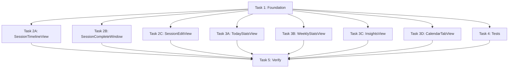

# Pause Visibility in Sessions — Implementation Plan

> **For Claude:** REQUIRED SUB-SKILL: Use superpowers:executing-plans to implement this plan task-by-task.

**Goal:** Surface pause count and pause time in every view that displays session data, so users are aware of how many pauses and how much pause time occurred per session and in aggregate.

**Architecture:** Add `pauseCount` to `FocusSession` model, wire it up on every exit from paused state in `TimerViewModel`, then update all session-displaying views in parallel to show `totalPausedSeconds` and `pauseCount`.

**Tech Stack:** Swift 6.2, SwiftUI, SwiftData

---

## Overview

Currently, `totalPausedSeconds` is accumulated on `FocusSession` but **never displayed** anywhere. `pauseCountThisSession` is tracked at runtime but **never persisted** to the model. This plan adds both model persistence and full UI visibility.

### Data Model Addition

**FocusSession** needs one new field:
- `pauseCount: Int = 0` — number of times the session was paused

### TimerViewModel Write Sites

`pauseCountThisSession` must be written to `session.pauseCount` at every exit from the paused state alongside the existing `totalPausedSeconds` writes:

| Site | Already writes `totalPausedSeconds` | Needs to also write `pauseCount` |
|------|--------------------------------------|----------------------------------|
| `resume()` | ✅ line 1334-1335 | ✅ |
| `stop()` while paused | ✅ line 1360-1361 | ✅ |
| `stopForReflection()` while paused | ✅ line 1426-1427 | ✅ |
| `switchProject()` | ✅ line 828-830 | ✅ |
| `resolveWakeRecovery(.keepOvertime)` | ✅ line 993-995 | ✅ (though sleep != pause, the count tracks paused sessions) |
| `timerCompleted()` | ❌ (can't be paused at completion) | ❌ |

### Display in Every Session Context

Each view gets a consistent treatment:
- **Per-session display:** Show `"X pauses · Ym Zs paused"` in the session row
- **Aggregate display:** Show total pause count and total pause time for the period

### Format

Pause time uses existing `.formattedFocusTime` (e.g., `"2m 30s"`). Pause count is shown as `"X pause(s)"`.

---

## Implementation Tasks

### Task 1: Foundation — Model + TimerViewModel

**Files:**
- Modify: `Sources/FocusFlow/Models/FocusSession.swift`
- Modify: `Sources/FocusFlow/ViewModels/TimerViewModel.swift`
- Modify: `Sources/FocusFlow/Views/Components/TimeFormatting.swift`

#### Step 1.1: Add `pauseCount` to FocusSession model

In `Models/FocusSession.swift`, add alongside `totalPausedSeconds`:

```swift
/// Number of times the session was paused.
/// Default is 0 so existing stored sessions are unaffected.
var pauseCount: Int = 0
```

Initialize to `0` in `init(...)`.

#### Step 1.2: Add `pauseLabel` computed property to FocusSession

```swift
/// Formatted pause info: "X pause(s) · Ym Zs paused"
/// Returns nil if the session had no pauses.
var pauseLabel: String? {
    guard totalPausedSeconds > 0 || pauseCount > 0 else { return nil }
    let timeStr = totalPausedSeconds.formattedFocusTime
    let countStr = pauseCount == 1 ? "1 pause" : "\(pauseCount) pauses"
    return "\(countStr) · \(timeStr) paused"
}
```

#### Step 1.3: Wire up `pauseCount` writes in TimerViewModel

In `resume()` (line ~1334-1335), add:
```swift
currentSession?.pauseCount = pauseCountThisSession
```

In `stop()` while paused block (line ~1360-1361), add:
```swift
session.pauseCount = pauseCountThisSession
```

In `stopForReflection()` while paused block (line ~1426-1427), add:
```swift
session.pauseCount = pauseCountThisSession
```

In `switchProject()` (line ~828-830), add:
```swift
oldSession.pauseCount = pauseCountThisSession
```

In `resolveWakeRecovery(.keepOvertime)` (line ~993-995), add:
```swift
session.pauseCount = pauseCountThisSession
```

Also in `timerCompleted()` (around line ~1911 area where `lastCompletedSession` is set), capture the pause count:
```swift
currentSession?.pauseCount = pauseCountThisSession
```

#### Step 1.4: Verify build

```bash
swift build
```

---

### Task 2: SessionTimelineView + SessionCompleteWindow (parallel)

#### Task 2A: SessionTimelineView — per-row pause display

**Files:**
- Modify: `Sources/FocusFlow/Views/Components/SessionTimelineView.swift`

**Goal:** Show pause count and pause time in each session row.

In the timeline row (around lines 75-91, where `actualDuration` is shown), add a subtitle line when `session.pauseLabel` is non-nil:

```swift
if let pauseLabel = session.pauseLabel {
    Text(pauseLabel)
        .font(.caption)
        .foregroundStyle(.tertiary)
}
```

Also update the accessibility label (line ~123) to include pause info.

#### Task 2B: SessionCompleteWindow — pause info in earned stage

**Files:**
- Modify: `Sources/FocusFlow/Views/SessionCompleteWindow.swift`

**Goal:** Show pause count/time in the earned stage (around lines 230-290) and stage 2 (around lines 390-410).

In the earned badge area (after `"✦ Xm earned"`), add:
```swift
if let pauseLabel = lastCompletedSession?.pauseLabel {
    Text(pauseLabel)
        .font(.caption)
        .foregroundStyle(.secondary)
}
```

In Stage 2 summary (after the duration line), add the same.

#### Task 2C: SessionEditView — pause info in timing section

**Files:**
- Modify: `Sources/FocusFlow/Views/Companion/SessionEditView.swift`

**Goal:** Show pause info in the `actualDurationRow` (lines 151-170).

Add after the actual/planned time display:
```swift
if let pauseLabel = session.pauseLabel {
    Text(pauseLabel)
        .font(.caption)
        .foregroundStyle(.tertiary)
}
```

---

### Task 3: Aggregate Stats Views (parallel)

#### Task 3A: TodayStatsView — today's pause stats

**Files:**
- Modify: `Sources/FocusFlow/Views/Companion/TodayStatsView.swift`

**Goal:** Add pause totals for today.

In `summarySection` (around lines 194-225), add a new StatCard showing today's total paused time and pause count. Or add a small row in the timeline section header (lines 507-519).

Best approach: Add a pause summary row in the timeline section header:
```swift
let todayPauses = todaySessions.reduce(0) { $0 + $1.pauseCount }
let todayPausedSeconds = todaySessions.reduce(0) { $0 + $1.totalPausedSeconds }
...
if todayPausedSeconds > 0 {
    Text("\(todayPauses) pause(s) · \(todayPausedSeconds.formattedFocusTime) paused")
        .font(.caption)
        .foregroundStyle(.tertiary)
}
```

#### Task 3B: WeeklyStatsView — per-day pause stats

**Files:**
- Modify: `Sources/FocusFlow/Views/Companion/WeeklyStatsView.swift`

**Goal:** Add pause totals to the day detail card (lines 160-186).

In the day detail card, after the session count line, add:
```swift
let daySessions = allSessions.filter { ... same filter as selectedDayDetail ... }
let totalPauseCount = daySessions.reduce(0) { $0 + $1.pauseCount }
let totalPausedSeconds = daySessions.reduce(0) { $0 + $1.totalPausedSeconds }
if totalPausedSeconds > 0 {
    Text("\(totalPauseCount) pause(s) · \(totalPausedSeconds.formattedFocusTime) paused")
}
```

#### Task 3C: InsightsView — pause trends

**Files:**
- Modify: `Sources/FocusFlow/Views/Companion/InsightsView.swift`

**Goal:** Add pause stats to the trends section (around lines 1577-1612 or behavioral insights around 1000-1063).

Add a pause stat to the 30-Day Trend section or behavioral insights. Best approach: add a small stat in the focus consistency section showing average pauses per session.

```swift
let totalPauses = focusSessions.reduce(0) { $0 + $1.pauseCount }
let avgPauses = focusSessions.isEmpty ? 0 : Double(totalPauses) / Double(focusSessions.count)
```

#### Task 3D: CalendarTabView — pause in day detail

**Files:**
- Modify: `Sources/FocusFlow/Views/Companion/CalendarTabView.swift`

**Goal:** Show pause info in the day detail section (lines 309-379).

In the day detail header (after the focused minutes line), add:
```swift
let daySessions = sessionsForDay(selectedDate)
let totalPauses = daySessions.reduce(0) { $0 + $1.pauseCount }
let totalPausedSeconds = daySessions.reduce(0) { $0 + $1.totalPausedSeconds }
if totalPausedSeconds > 0 {
    Text("\(totalPauses) pause(s) · \(totalPausedSeconds.formattedFocusTime) paused")
        .font(.caption)
        .foregroundStyle(.tertiary)
}
```

---

### Task 4: Tests

**Files:**
- Modify: `Tests/FocusFlowTests/TimerCompletionFlowTests.swift`
- Create: `Tests/FocusFlowTests/PauseVisibilityTests.swift` (or add to existing)

#### Test 4.1: Model default
```swift
func testNewSessionHasZeroPauseCount() {
    let session = FocusSession(type: .focus, duration: 1800)
    XCTAssertEqual(session.pauseCount, 0)
    XCTAssertEqual(session.totalPausedSeconds, 0)
    XCTAssertNil(session.pauseLabel)
}
```

#### Test 4.2: pauseLabel formatting
```swift
func testPauseLabelFormatsCorrectly() {
    let session = FocusSession(type: .focus, duration: 1800)
    session.pauseCount = 3
    session.totalPausedSeconds = 600
    XCTAssertEqual(session.pauseLabel, "3 pauses · 10m 0s paused")
}
```

#### Test 4.3: Single pause label
```swift
func testPauseLabelSingular() {
    let session = FocusSession(type: .focus, duration: 1800)
    session.pauseCount = 1
    session.totalPausedSeconds = 120
    XCTAssertEqual(session.pauseLabel, "1 pause · 2m 0s paused")
}
```

#### Test 4.4: TimerViewModel writes pauseCount
Add assertions to existing tests:
- `testResumeAccumulatesPauseIntoSession` — verify `session.pauseCount` >= 1
- `testStopWhilePausedAccumulatesPauseIntoSession` — verify `session.pauseCount` >= 1
- `testSwitchProjectWhilePausedAccumulatesPauseToCorrectSession` — verify old session has `pauseCount` >= 1, new session has 0

---

### Task 5: Verification

```bash
swift build
swift test
```

---

## Execution Strategy

This plan has one sequential dependency (Task 1 must complete before Tasks 2-3 can build), but Tasks 2A-2C and 3A-3D are all independent of each other and can run in parallel.

**Execution order:**
1. Task 1 (Foundation) — sequential, prerequisite
2. Tasks 2A + 2B + 2C (Direct session display) — parallel
3. Tasks 3A + 3B + 3C + 3D (Aggregate stats) — parallel
4. Task 4 (Tests) — can start after Task 1
5. Task 5 (Verification) — sequential

Total: 1 (sequential) + 3 (parallel) + 4 (parallel) + 1 (sequential) = ~4-5 rounds

## Task Dependencies


